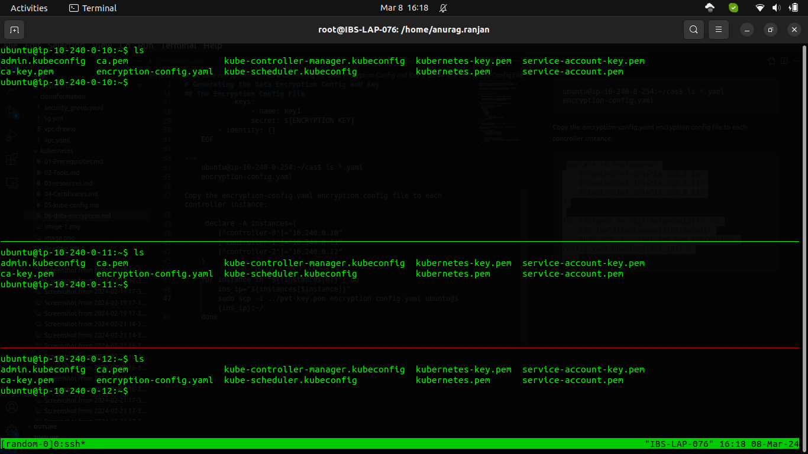

# Generating the Data Encryption Config and Key

Kubernetes stores a variety of data including cluster state, application configurations, and secrets. Kubernetes supports the ability to encrypt cluster data at rest.

In this we will be generate an encryption key and an encryption config suitable for encrypting Kubernetes Secrets.

## The Encryption Key

Generate an encryption key:

    ENCRYPTION_KEY=$(head -c 32 /dev/urandom | base64)
---
    ubuntu@ip-10-240-0-254:~/cas$ echo $ENCRYPTION_KEY
    oHC83yw7YkPfzpL5gtn7kiuNP7un09YEn0hDQfTcQFw=

## The Encryption Config File
Create the encryption-config.yaml encryption config file:

    cat > encryption-config.yaml <<EOF
    kind: EncryptionConfig
    apiVersion: v1
    resources:
    - resources:
        - secrets
        providers:
        - aescbc:
            keys:
                - name: key1
                secret: ${ENCRYPTION_KEY}
        - identity: {}
    EOF

---
    ubuntu@ip-10-240-0-254:~/cas$ ls *.yaml
    encryption-config.yaml

Copy the encryption-config.yaml encryption config file to each controller instance:

     declare -A instances=(
        ["controller-0"]="10.240.0.10"
        ["controller-1"]="10.240.0.11"
        ["controller-2"]="10.240.0.12"
    )

    for instance in "${!instances[@]}"; do
        ins_ip="${instances[$instance]}"
        sudo scp -i ../pvt-key.pem encryption-config.yaml ubuntu@${ins_ip}:~/
    done

