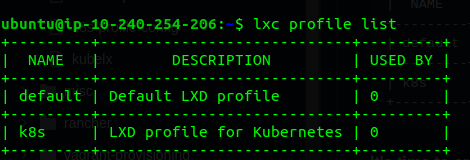
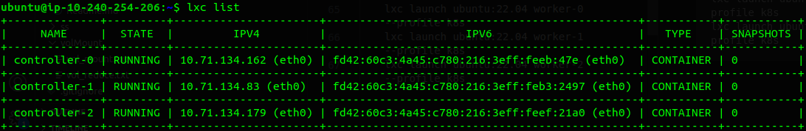
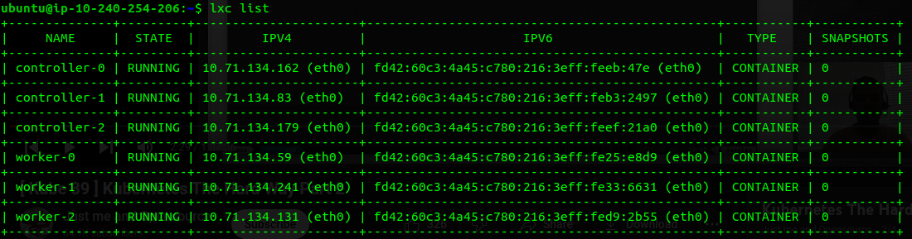
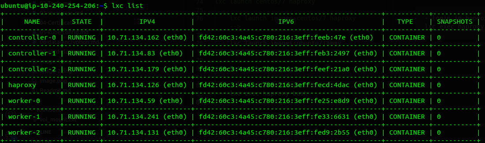
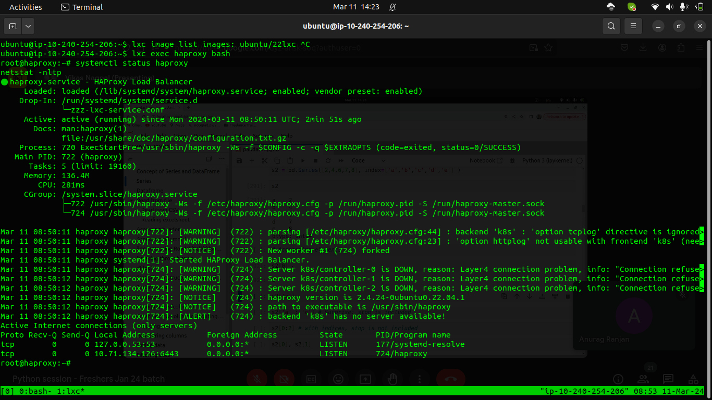
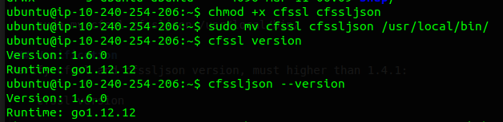
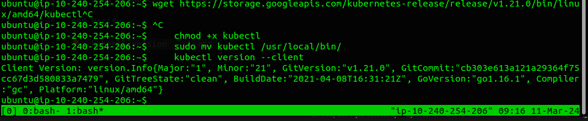

# Setting up K8s Cluster using LXC/LXD

In this case I am use an AWS EC2 instance

Create an EC2 instance of type t2.xlarge size which will be sufficient for running 6 lxc containers each with 2 CPUs and 2Gi of memory.

### Installing the LXC on Ubuntu

    sudo apt-get update && sudo apt-get install lxc -y
    sudo systemctl status lxc
    sudo snap install lxd 
    lxd init


- Default for everything except this:
    Name of the storage backend to use (btrfs, dir, lvm) [default=btrfs]: dir

### Let's create profile for k8s cluster

    lxc profile create k8s
    sudo lxc profile edit k8s
---
paste this

    config:
        limits.cpu: "1"
        limits.memory: 2GB
        limits.memory.swap: "false"
        linux.kernel_modules: ip_tables,ip6_tables,nf_nat,overlay,br_netfilter
        raw.lxc: "lxc.apparmor.profile=unconfined\nlxc.cap.drop= \nlxc.cgroup.devices.allow=a\nlxc.mount.auto=proc:rw
            sys:rw"
        security.privileged: "true"
        security.nesting: "true"
    description: LXD profile for Kubernetes
    devices:
        eth0:
            name: eth0
            nictype: bridged
            parent: lxdbr0
            type: nic
        kmsg:
            path: /dev/kmsg
            source: /dev/kmsg
            type: unix-char
        root:
            path: /
            pool: default
            type: disk
    name: k8s
    used_by: []
---
    lxc profile list




### Creating nodes for controller and worker

#### 3 Controller nodes for high avaliablity
```
lxc launch ubuntu:22.04 controller-0 --profile k8s
lxc launch ubuntu:22.04 controller-1 --profile k8s
lxc launch ubuntu:22.04 controller-2 --profile k8s
```

#### 3 Worker nodes
```
lxc launch ubuntu:22.04 worker-0 --profile k8s
lxc launch ubuntu:22.04 worker-1 --profile k8s
lxc launch ubuntu:22.04 worker-2 --profile k8s
```


#### A haproxy to server as a loadbalancer for our controllers
<!-- 
lxc image copy images:centos/7 local: --copy-aliases
lxc image unset-property centos/7 requirements.cgroup
lxc launch centos/7 haproxy

    lxc launch images:centos/7 haproxy -->

    lxc launch images:ubuntu:22.04 haproxy

### Setup the haproxy

- login in haproxy container
---
    lxc exec haproxy bash
---
    apt-get update
    apt install -y haproxy net-tools

---
---
If the outgoing traffic is not working

    for ipt in iptables iptables-legacy ip6tables ip6tables-legacy; do 
    sudo $ipt --flush; 
    sudo $ipt --flush -t nat;
    sudo $ipt --delete-chain;
    sudo $ipt --delete-chain -t nat; 
    sudo $ipt -P FORWARD ACCEPT; 
    sudo $ipt -P INPUT ACCEPT; 
    sudo $ipt -P OUTPUT ACCEPT; 
    done
    sudo  systemctl reload snap.lxd.daemon 

add line to config files

    nano /etc/haproxy/haproxy.cfg

add to the end to the file
-
    frontend k8s
        bind 10.210.42.222:6443
        mode tcp
        default_backend k8s

    backend k8s
            balance roundrobin
            mode tcp
            option tcplog
            option tcp-check
            server controller-0 10.210.42.223:6443 check
            server controller-1 10.210.42.87:6443 check
            server controller-2 10.210.42.137:6443 check

start the haproxy
---

    systemctl restart haproxy

check
---
    systemctl enable haproxy
    systemctl status haproxy
    netstat -nltp



# Installing the Client Tools

##### In this lab we will install the command line utilites required to complete the setup:
- cfssl
- cfssljson
- kubectl

### We will be using a jump server inside the VPC we will create further to install these requirements, so that we can easily transfer the files in the kube-nodes

## 1. Install CFSSL

The cfssl and cfssljson command line utilities will be used to provision a PKI Infrastructure and generate TLS certificates.

#### Linux

    wget -q --show-progress --https-only --timestamping \
    https://github.com/cloudflare/cfssl/releases/download/v1.6.0/cfssl_1.6.0_linux_amd64  -O cfssl
---
    wget -q --show-progress --https-only --timestamping \
    https://github.com/cloudflare/cfssl/releases/download/v1.6.0/cfssljson_1.6.0_linux_amd64 -O cfssljson
---
    chmod +x cfssl cfssljson

    sudo mv cfssl cfssljson /usr/local/bin/

### Verification
Verify cfssl and cfssljson version, must higher than 1.4.1:

    cfssl version

    cfssljson --version

## 2. Install kubectl

Kubernetes provides a command line tool for communicating with a Kubernetes cluster's control plane, using the Kubernetes API.

#### Linux

    wget https://storage.googleapis.com/kubernetes-release/release/v1.12.0/bin/linux/amd64/kubectl

    chmod +x kubectl

    sudo mv kubectl /usr/local/bin/

### Verify

    kubectl version --client
