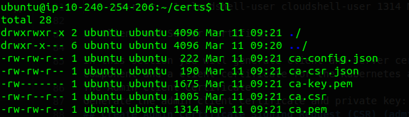
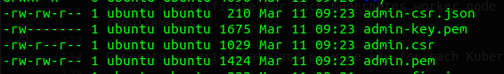
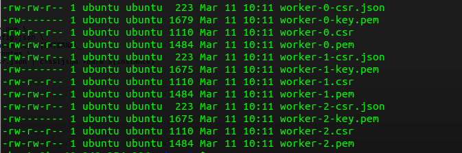
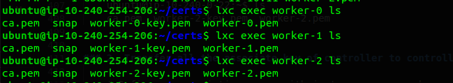
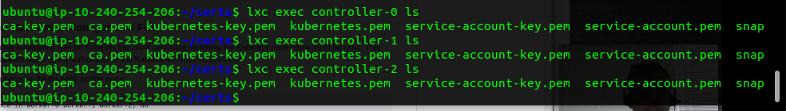

# Provisioning a CA and Generating TLS Certificates

TLS (Transport Layer Security) certificates play a critical role in securing communication within a Kubernetes cluster. Here's how they are utilized:

- **Encryption:** TLS certificates encrypt communication between various components of the Kubernetes cluster, including API servers, kubelets, and etcd, ensuring that sensitive data remains confidential.

- **Authentication:** TLS certificates are used for authenticating the identity of Kubernetes components. For example, when a kubelet communicates with the API server, it presents its TLS certificate, which is validated to ensure the kubelet's authenticity.

- **Integrity:** TLS certificates ensure the integrity of data exchanged within the Kubernetes cluster. By employing cryptographic techniques, TLS prevents data tampering during transmission, safeguarding against unauthorized modifications.

- **Securing API Endpoints:** Kubernetes API endpoints, such as the kube-apiserver, are secured using TLS certificates. Clients, including administrators and controllers, authenticate themselves to the API server using client TLS certificates.

- **Service Communication:** TLS certificates are used to secure communication between Kubernetes services. When services communicate over the network, TLS ensures that data is encrypted and exchanged securely.

---
In this lab we are going to use `cfssl` to create a Certificate Authority, so that we can use it to Generate TLS Certificates for the following components:

- Kubernetes Root CA Certificate
- Cluster admin client certificate
- kube-controller-manager client certificate
- kube-scheduler client certificate
- kube-apiserver server certificate
- kube-apiserver’s kubelet client certificate
- kubelet client certificate
## NOTE: We will be running these commands inside `kubernetes-jump-server` instance, created inside the `kuberenetes-hard-way-subnet`

## Certificate Authority
In this we are going to provision a Certficate Authority that will be used to generate additional TLS Certificates.

**Purpose:** It ensures secure communication by providing trusted certificates within the Kubernetes cluster.

Generate the CA configuration file, certificate, and private key:

    {
    cat > ca-config.json <<EOF
    {
    "signing": {
        "default": {
        "expiry": "8760h"
        },
        "profiles": {
        "kubernetes": {
            "usages": ["signing", "key encipherment", "server auth", "client auth"],
            "expiry": "8760h"
        }
        }
    }
    }
    EOF

    cat > ca-csr.json <<EOF
    {
    "CN": "kubernetes",
    "key": {
        "algo": "rsa",
        "size": 2048
    },
    "names": [
        {
        "C": "India",
        "L": "Delhi",
        "O": "Kubernetes",
        "OU": "CA",
        "ST": "Delhi"
        }
    ]
    }
    EOF

    cfssl gencert -initca ca-csr.json | cfssljson -bare ca
    }

OUTPUT 

2. Client and Server Certificates

In this section you will generate client and server certificates for each Kubernetes component and a client certificate for the Kubernetes admin user.
The Admin Client Certificate
Generate the admin client certificate and private key:
## Create Admin Certificate Signing Request (CSR) (admin-csr.json):

    {
    cat > admin-csr.json <<EOF
    {
    "CN": "admin",
    "key": {
        "algo": "rsa",
        "size": 2048
    },
    "names": [
        {
        "C": "India",
        "L": "Delhi",
        "O": "system:masters",
        "OU": "Kubernetes The Hard Way",
        "ST": "Delhi"
        }
    ]
    }
    EOF

    cfssl gencert \
    -ca=ca.pem \
    -ca-key=ca-key.pem \
    -config=ca-config.json \
    -profile=kubernetes \
    admin-csr.json | cfssljson -bare admin
    }

OUTPUT

## 3. The Kubelet Client Certificates

Kubernetes uses a special-purpose authorization mode called Node Authorizer, that specifically authorizes API requests made by Kubelets. In order to be authorized by the Node Authorizer, Kubelets must use a credential that identifies them as being in the system:nodes group, with a username of system:node:<nodeName>. In this section you will create a certificate for each Kubernetes worker node that meets the Node Authorizer requirements.

Generate a certificate and private key for each Kubernetes worker node:

    for instance in worker-0 worker-1 worker-2; do
        # Define the CSR JSON file for the instance
        cat > ${instance}-csr.json <<EOF
    {
    "CN": "system:node:${instance}",
    "key": {
        "algo": "rsa",
        "size": 2048
    },
    "names": [
        {
        "C": "India",
        "L": "Delhi",
        "O": "system:nodes",
        "OU": "Kubernetes The Hard Way",
        "ST": "Delhi"
        }
    ]
    }
    EOF

    # Obtain the private IP address of the instance
    EXTERNAL_IP=$(lxc list | grep $instance | awk '{print$6}')
    echo $EXTERNAL_IP

    # Generate the certificate using cfssl
    cfssl gencert \
        -ca=ca.pem \
        -ca-key=ca-key.pem \
        -config=ca-config.json \
        -hostname=${instance},${EXTERNAL_IP} \
        -profile=kubernetes \
        ${instance}-csr.json | cfssljson -bare ${instance}
    done

    OUTPUT

## 4. The Controller Manager Client Certificate
Generate the kube-controller-manager client certificate and private key:

    {

    cat > kube-controller-manager-csr.json <<EOF
    {
    "CN": "system:kube-controller-manager",
    "key": {
        "algo": "rsa",
        "size": 2048
    },
    "names": [
        {
        "C": "India",
        "L": "Delhi",
        "O": "system:kube-controller-manager",
        "OU": "Kubernetes The Hard Way",
        "ST": "Delhi"
        }
    ]
    }
    EOF

    cfssl gencert \
    -ca=ca.pem \
    -ca-key=ca-key.pem \
    -config=ca-config.json \
    -profile=kubernetes \
    kube-controller-manager-csr.json | cfssljson -bare kube-controller-manager

    }

OUTPUT

    -rw-r--r-- 1 cloudshell-user cloudshell-user 1086 Mar  8 06:15 kube-controller-manager.csr
    -rw-r--r-- 1 cloudshell-user cloudshell-user  251 Mar  8 06:15 kube-controller-manager-csr.json
    -rw------- 1 cloudshell-user cloudshell-user 1675 Mar  8 06:15 kube-controller-manager-key.pem
    -rw-r--r-- 1 cloudshell-user cloudshell-user 1480 Mar  8 06:15 kube-controller-manager.pem

## 5. The Kube Proxy Client Certificate
Generate the kube-proxy client certificate and private key:

**Use:** Used by the Kubernetes Proxy to communicate securely with the Kubernetes API server.

**Importance:** Enables the Kubernetes Proxy to perform its network proxying duties securely, enhancing network security within the cluster.

    {

    cat > kube-proxy-csr.json <<EOF
    {
    "CN": "system:kube-proxy",
    "key": {
        "algo": "rsa",
        "size": 2048
    },
    "names": [
        {
        "C": "India",
        "L": "Delhi",
        "O": "system:node-proxier",
        "OU": "Kubernetes The Hard Way",
        "ST": "Delhi"
        }
    ]
    }
    EOF

    cfssl gencert \
    -ca=ca.pem \
    -ca-key=ca-key.pem \
    -config=ca-config.json \
    -profile=kubernetes \
    kube-proxy-csr.json | cfssljson -bare kube-proxy
    }

OUTPUT

    -rw-r--r-- 1 cloudshell-user cloudshell-user 1054 Mar  8 06:20 kube-proxy.csr
    -rw-r--r-- 1 cloudshell-user cloudshell-user  227 Mar  8 06:20 kube-proxy-csr.json
    -rw------- 1 cloudshell-user cloudshell-user 1679 Mar  8 06:20 kube-proxy-key.pem
    -rw-r--r-- 1 cloudshell-user cloudshell-user 1448 Mar  8 06:20 kube-proxy.pem

## 6. The Scheduler Client Certificate
Generate the kube-scheduler client certificate and private key:

**Use:** Allows the Kubernetes Scheduler to communicate securely with the Kubernetes API server.

**Importance:** Ensures that the Scheduler is properly authenticated and authorized, enabling it to schedule pods securely and efficiently.

    {

    cat > kube-scheduler-csr.json <<EOF
    {
    "CN": "system:kube-scheduler",
    "key": {
        "algo": "rsa",
        "size": 2048
    },
    "names": [
        {
        "C": "India",
        "L": "Delhi",
        "O": "system:kube-scheduler",
        "OU": "Kubernetes The Hard Way",
        "ST": "Delhi"
        }
    ]
    }
    EOF

    cfssl gencert \
    -ca=ca.pem \
    -ca-key=ca-key.pem \
    -config=ca-config.json \
    -profile=kubernetes \
    kube-scheduler-csr.json | cfssljson -bare kube-scheduler

    }

OUTPUT

    -rw-r--r-- 1 cloudshell-user cloudshell-user 1062 Mar  8 06:22 kube-scheduler.csr
    -rw-r--r-- 1 cloudshell-user cloudshell-user  253 Mar  8 06:22 kube-scheduler-csr.json
    -rw------- 1 cloudshell-user cloudshell-user 1679 Mar  8 06:22 kube-scheduler-key.pem
    -rw-r--r-- 1 cloudshell-user cloudshell-user 1456 Mar  8 06:22 kube-scheduler.pem

## 6. The Kubernetes API Server Certificate

The kubernetes-the-hard-way static IP address will be included in the list of subject alternative names for the Kubernetes API Server certificate. This will ensure the certificate can be validated by remote clients.

Generate the Kubernetes API Server certificate and private key:

**Use:** Secures communication between clients and the Kubernetes API server.

**Importance:** Establishes trust and encryption for all API requests, ensuring the integrity and confidentiality of communication within the cluster.

KUBERNETES_PUBLIC_ADDRESS -> Elastic IP Address
hostname -> private-ip of controller nodes

    {

    KUBERNETES_PUBLIC_ADDRESS=10.210.42.222

    KUBERNETES_HOSTNAMES=kubernetes,kubernetes.default,kubernetes.default.svc,kubernetes.default.svc.cluster,kubernetes.svc.cluster.local

    cat > kubernetes-csr.json <<EOF
    {
    "CN": "kubernetes",
    "key": {
        "algo": "rsa",
        "size": 2048
    },
    "names": [
        {
        "C": "India",
        "L": "Delhi",
        "O": "Kubernetes",
        "OU": "Kubernetes The Hard Way",
        "ST": "Delhi"
        }
    ]
    }
    EOF

    cfssl gencert \
    -ca=ca.pem \
    -ca-key=ca-key.pem \
    -config=ca-config.json \
    -hostname=10.210.42.223,10.210.42.87,10.210.42.137,${KUBERNETES_PUBLIC_ADDRESS},127.0.0.1,${KUBERNETES_HOSTNAMES} \
    -profile=kubernetes \
    kubernetes-csr.json | cfssljson -bare kubernetes

    }

OUTPUT

    -rw-r--r-- 1 cloudshell-user cloudshell-user 1281 Mar  8 06:41 kubernetes.csr
    -rw-r--r-- 1 cloudshell-user cloudshell-user  231 Mar  8 06:41 kubernetes-csr.json
    -rw------- 1 cloudshell-user cloudshell-user 1679 Mar  8 06:41 kubernetes-key.pem
    -rw-r--r-- 1 cloudshell-user cloudshell-user 1651 Mar  8 06:41 kubernetes.pem

## 7. The Service Account Key Pair

The Kubernetes Controller Manager leverages a key pair to generate and sign service account tokens as described in the managing service accounts documentation.

Generate the service-account certificate and private key:

    {

    cat > service-account-csr.json <<EOF
    {
    "CN": "service-accounts",
    "key": {
        "algo": "rsa",
        "size": 2048
    },
    "names": [
        {
        "C": "India",
        "L": "Delhi",
        "O": "Kubernetes",
        "OU": "Kubernetes The Hard Way",
        "ST": "Delhi"
        }
    ]
    }
    EOF

    cfssl gencert \
    -ca=ca.pem \
    -ca-key=ca-key.pem \
    -config=ca-config.json \
    -profile=kubernetes \
    service-account-csr.json | cfssljson -bare service-account

    }

OUTPUT

    -rw-r--r-- 1 cloudshell-user cloudshell-user 1041 Mar  8 06:43 service-account.csr
    -rw-r--r-- 1 cloudshell-user cloudshell-user  237 Mar  8 06:43 service-account-csr.json
    -rw------- 1 cloudshell-user cloudshell-user 1675 Mar  8 06:43 service-account-key.pem
    -rw-r--r-- 1 cloudshell-user cloudshell-user 1436 Mar  8 06:43 service-account.pem

## Now all the certificates are created and signed

### 1. Transfer all the associate key of worker to worker 

    for instance in worker-0 worker-1 worker-2; do
    lxc file push ca.pem ${instance}-key.pem ${instance}.pem ${instance}/root/
    done

RESULT

### 2. Transfer all the associate key of controller to controller 

    for instance in controller-0 controller-1 controller-2; do
        lxc file push ca.pem ca-key.pem kubernetes-key.pem kubernetes.pem service-account-key.pem service-account.pem ${instance}/root/
    done

RESULT

 