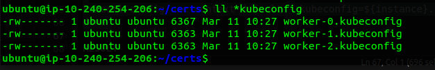
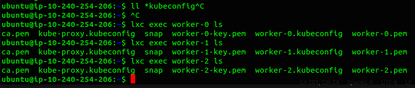
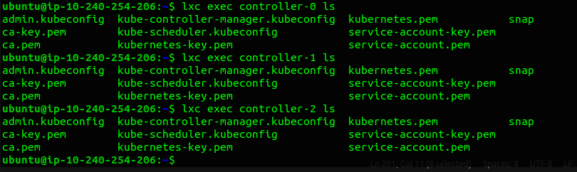

# Generating Kubernetes Configuration Files for Authentication

Now we are going to generate some config files which will enables kubernetes client to locate and authenticate to the kubernetes API Servers.

**Objective**
- Generate kubeconfig files to facilitate authentication and authorization for Kubernetes clients.
- Enable Kubernetes clients to locate and authenticate to the Kubernetes API Servers securely.

## Client Authentication Configs:

**Components:**     
Generate kubeconfig files for various Kubernetes components and users:
- `controller manager`
- `kubelet`
- `kube-proxy`
- `scheduler`
- `admin user`

**Purpose:**        
Each configuration serves a specific client type, enabling them to authenticate to the Kubernetes API Server securely.

### Kubernetes Public IP Address
Each kubeconfig requires an API Server to connect to. Here we are using haproxy to support high availability of the API Server.

Here we are using container-ip `10.71.134.126 (eth0)` of the haproxy:
    
    KUBERNETES_PUBLIC_ADDRESS=10.71.134.126

---
### kubelet Kubernetes Configuration File:

**Purpose:** Generate kubeconfig files for Kubelets, ensuring proper authentication and authorization.

**Components:** Configuration includes:
- Cluster settings (server, CA certificate)
- Client credentials (client certificate, key)
- Context settings (cluster, user)

**Usage:** These files enable Kubelets to securely communicate with the Kubernetes API Server.

######  The following commands must be run in the same directory used to generate the SSL certificates during the Generating TLS Certificates.

Generate a kubeconfig file for each worker node:

    for instance in worker-0 worker-1 worker-2; do
    kubectl config set-cluster kubernetes-the-hard-way \
        --certificate-authority=ca.pem \
        --embed-certs=true \
        --server=https://${KUBERNETES_PUBLIC_ADDRESS}:6443 \
        --kubeconfig=${instance}.kubeconfig

    kubectl config set-credentials system:node:${instance} \
        --client-certificate=${instance}.pem \
        --client-key=${instance}-key.pem \
        --embed-certs=true \
        --kubeconfig=${instance}.kubeconfig

    kubectl config set-context default \
        --cluster=kubernetes-the-hard-way \
        --user=system:node:${instance} \
        --kubeconfig=${instance}.kubeconfig

    kubectl config use-context default --kubeconfig=${instance}.kubeconfig
    done

RESULT

---
### The kube-proxy Kubernetes Configuration File
Generate a kubeconfig file for the kube-proxy service:

    {
    kubectl config set-cluster kubernetes-the-hard-way \
        --certificate-authority=ca.pem \
        --embed-certs=true \
        --server=https://${KUBERNETES_PUBLIC_ADDRESS}:6443 \
        --kubeconfig=kube-proxy.kubeconfig

    kubectl config set-credentials system:kube-proxy \
        --client-certificate=kube-proxy.pem \
        --client-key=kube-proxy-key.pem \
        --embed-certs=true \
        --kubeconfig=kube-proxy.kubeconfig

    kubectl config set-context default \
        --cluster=kubernetes-the-hard-way \
        --user=system:kube-proxy \
        --kubeconfig=kube-proxy.kubeconfig

    kubectl config use-context default --kubeconfig=kube-proxy.kubeconfig
    }

RESULT 
    
    -rw------- 1 ubuntu ubuntu 6313 Mar  8 09:51 kube-proxy.kubeconfig

### The kube-controller-manager Kubernetes Configuration File
Generate a kubeconfig file for the kube-controller-manager service:

    {
    kubectl config set-cluster kubernetes-the-hard-way \
        --certificate-authority=ca.pem \
        --embed-certs=true \
        --server=https://127.0.0.1:6443 \
        --kubeconfig=kube-controller-manager.kubeconfig

    kubectl config set-credentials system:kube-controller-manager \
        --client-certificate=kube-controller-manager.pem \
        --client-key=kube-controller-manager-key.pem \
        --embed-certs=true \
        --kubeconfig=kube-controller-manager.kubeconfig

    kubectl config set-context default \
        --cluster=kubernetes-the-hard-way \
        --user=system:kube-controller-manager \
        --kubeconfig=kube-controller-manager.kubeconfig

    kubectl config use-context default --kubeconfig=kube-controller-manager.kubeconfig
    }

RESULT

    -rw------- 1 ubuntu ubuntu 6375 Mar  8 09:55 kube-controller-manager.kubeconfig

### The kube-scheduler Kubernetes Configuration File
Generate a kubeconfig file for the kube-scheduler service:

    {
    kubectl config set-cluster kubernetes-the-hard-way \
        --certificate-authority=ca.pem \
        --embed-certs=true \
        --server=https://127.0.0.1:6443 \
        --kubeconfig=kube-scheduler.kubeconfig

    kubectl config set-credentials system:kube-scheduler \
        --client-certificate=kube-scheduler.pem \
        --client-key=kube-scheduler-key.pem \
        --embed-certs=true \
        --kubeconfig=kube-scheduler.kubeconfig

    kubectl config set-context default \
        --cluster=kubernetes-the-hard-way \
        --user=system:kube-scheduler \
        --kubeconfig=kube-scheduler.kubeconfig

    kubectl config use-context default --kubeconfig=kube-scheduler.kubeconfig
    }

RESULT 

    -rw------- 1 ubuntu ubuntu 6329 Mar  8 09:56 kube-scheduler.kubeconfig

### The admin Kubernetes Configuration File
Generate a kubeconfig file for the admin user:

    {
    kubectl config set-cluster kubernetes-the-hard-way \
        --certificate-authority=ca.pem \
        --embed-certs=true \
        --server=https://127.0.0.1:6443 \
        --kubeconfig=admin.kubeconfig

    kubectl config set-credentials admin \
        --client-certificate=admin.pem \
        --client-key=admin-key.pem \
        --embed-certs=true \
        --kubeconfig=admin.kubeconfig

    kubectl config set-context default \
        --cluster=kubernetes-the-hard-way \
        --user=admin \
        --kubeconfig=admin.kubeconfig

    kubectl config use-context default --kubeconfig=admin.kubeconfig
    }

RESULT

    -rw------- 1 ubuntu ubuntu 6249 Mar  8 09:58 admin.kubeconfig

---
### FINAL

##### Now we are done with genration of kubeconfig files for each component of respected continers
---

## Distribute the Kubernetes Configuration Files

#### Copy the appropriate kubelet and kube-proxy kubeconfig files to each worker instance:

    for instance in worker-0 worker-1 worker-2; do
    lxc file push ${instance}.kubeconfig kube-proxy.kubeconfig ${instance}/root/
    done

#### Copy the appropriate kube-controller-manager and kube-scheduler kubeconfig files to each controller instance:
    
    for instance in controller-0 controller-1 controller-2; do
        lxc file push admin.kubeconfig kube-controller-manager.kubeconfig kube-scheduler.kubeconfig ${instance}/root/
    done
    
