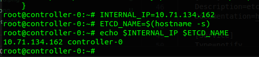
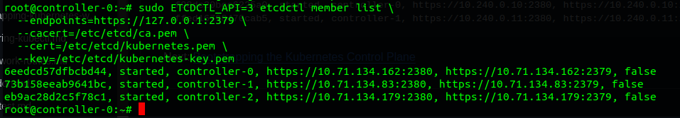

# Bootstrapping the etcd Cluster

Kubernetes components are stateless and store cluster state in etcd. In this lab you will bootstrap a three node etcd cluster and configure it for high availability and secure remote access.

## Prerequisites

The commands must be run on each controller instance:
`controller-0`, `controller-1`, and `controller-2`.

Login to each controller instance using and copying Controller Variables to the controller nodes

<!-- ```

lxc exec controller-0 -- env CONTROLLER_0="$CONTROLLER_0" CONTROLLER_1="$CONTROLLER_1" CONTROLLER_2="$CONTROLLER_2" bash

lxc exec controller-1 -- env CONTROLLER_0="$CONTROLLER_0"    CONTROLLER_1="$CONTROLLER_1" CONTROLLER_2="$CONTROLLER_2" bash

lxc exec controller-2 -- env CONTROLLER_0="$CONTROLLER_0" CONTROLLER_1="$CONTROLLER_1" CONTROLLER_2="$CONTROLLER_2" bash

``` -->

CHECK FOR `env CONTROLLER_*`

```
echo $CONTROLLER_0 $CONTROLLER_1 $CONTROLLER_2
```

IF not present the set manually

```
{
    CONTROLLER_0=10.165.235.89
    CONTROLLER_1=10.165.235.123
    CONTROLLER_2=10.165.235.102
}
```

## Bootstrapping an etcd Cluster Member

### Download and Install the etcd Binaries

Download the official etcd release binaries from the etcd GitHub project:
LINUX

```
{
ETCD_VER=v3.4.15
GOOGLE_URL=https://storage.googleapis.com/etcd
DOWNLOAD_URL=${GOOGLE_URL}

wget -q --show-progress --https-only --timestamping  ${DOWNLOAD_URL}/${ETCD_VER}/etcd-${ETCD_VER}-linux-amd64.tar.gz

tar -xvf etcd-${ETCD_VER}-linux-amd64.tar.gz
sudo mv etcd-${ETCD_VER}-linux-amd64/etcd* /usr/local/bin/
}
```

CHECK

```
{
etcd --version
etcdctl version
}
```

### Configure the etcd Server

```
{
sudo mkdir -p /etc/etcd /var/lib/etcd
sudo chmod 700 /var/lib/etcd
sudo cp ca.pem kubernetes-key.pem kubernetes.pem /etc/etcd/
}
```

The instance internal IP address will be used to serve client requests and communicate with etcd cluster peers. Retrieve the internal IP address for the current compute instance:

<!-- ##### Different for each controller -->

```
INTERNAL_IP=$(hostname -i | awk '{print$2}')
```

Each etcd member must have a unique name within an etcd cluster. Set the etcd name to match the hostname of the current compute instance:

```
ETCD_NAME=$(hostname -s)
```

---

```
echo $INTERNAL_IP $ETCD_NAME
```



Create the etcd.service systemd unit file:

##### Same for each controller

```
cat <<EOF | sudo tee /etc/systemd/system/etcd.service
[Unit]
Description=etcd
Documentation=https://github.com/coreos

[Service]
Type=notify
ExecStart=/usr/local/bin/etcd \\
--name ${ETCD_NAME} \\
--cert-file=/etc/etcd/kubernetes.pem \\
--key-file=/etc/etcd/kubernetes-key.pem \\
--peer-cert-file=/etc/etcd/kubernetes.pem \\
--peer-key-file=/etc/etcd/kubernetes-key.pem \\
--trusted-ca-file=/etc/etcd/ca.pem \\
--peer-trusted-ca-file=/etc/etcd/ca.pem \\
--peer-client-cert-auth \\
--client-cert-auth \\
--initial-advertise-peer-urls 'https://${INTERNAL_IP}:2380' \\
--listen-peer-urls 'https://${INTERNAL_IP}:2380' \\
--listen-client-urls 'https://${INTERNAL_IP}:2379','https://127.0.0.1:2379' \\
--advertise-client-urls 'https://${INTERNAL_IP}:2379' \\
--initial-cluster-token etcd-cluster-0 \\
--initial-cluster controller-0='https://${CONTROLLER_0}:2380',controller-1='https://${CONTROLLER_1}:2380',controller-2='https://${CONTROLLER_2}:2380' \\
--initial-cluster-state new \\
--data-dir=/var/lib/etcd
Restart=on-failure
RestartSec=5

[Install]
WantedBy=multi-user.target
EOF
```

Start the etcd Server

```
{
sudo systemctl daemon-reload
sudo systemctl enable etcd
sudo systemctl start etcd
}
```

#### Remember to run the above commands on each controller node: `controller-0`, `controller-1`, and `controller-2`.

### Verfication

```
sudo ETCDCTL_API=3 etcdctl member list \
--endpoints=https://127.0.0.1:2379 \
--cacert=/etc/etcd/ca.pem \
--cert=/etc/etcd/kubernetes.pem \
--key=/etc/etcd/kubernetes-key.pem
```


