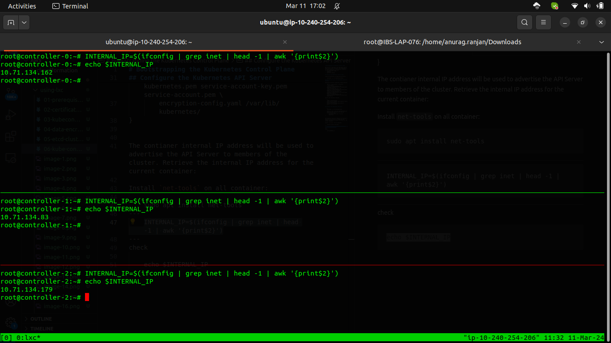
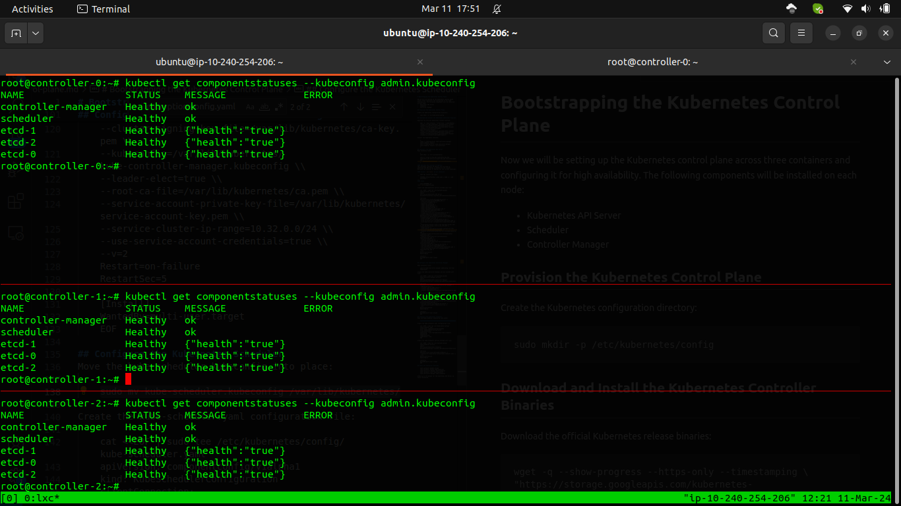

# Bootstrapping the Kubernetes Control Plane

Now we will be setting up the Kubernetes control plane across three containers and configuring it for high availability. The following components will be installed on each node: 
-   Kubernetes API Server
-   Scheduler
-   Controller Manager

## Provision the Kubernetes Control Plane

Create the Kubernetes configuration directory:

    sudo mkdir -p /etc/kubernetes/config

## Download and Install the Kubernetes Controller Binaries

Download the official Kubernetes release binaries:

    wget -q --show-progress --https-only --timestamping \
    "https://storage.googleapis.com/kubernetes-release/release/v1.12.0/bin/linux/amd64/kube-apiserver" \
    "https://storage.googleapis.com/kubernetes-release/release/v1.12.0/bin/linux/amd64/kube-controller-manager" \
    "https://storage.googleapis.com/kubernetes-release/release/v1.12.0/bin/linux/amd64/kube-scheduler" \
    "https://storage.googleapis.com/kubernetes-release/release/v1.12.0/bin/linux/amd64/kubectl"

Install the Kubernetes binaries:

    {
    chmod +x kube-apiserver kube-controller-manager kube-scheduler kubectl
    sudo mv kube-apiserver kube-controller-manager kube-scheduler kubectl /usr/local/bin/
    }

## Configure the Kubernetes API Server
Move necessary files:

    {
    sudo mkdir -p /var/lib/kubernetes/

    sudo mv ca.pem ca-key.pem kubernetes-key.pem kubernetes.pem service-account-key.pem service-account.pem \
        encryption-config.yaml /var/lib/kubernetes/
    }

#### Retrieve the internal IP address:
The contianer internal IP address will be used to advertise the API Server to members of the cluster. Retrieve the internal IP address for the current container:

#### Install `net-tools` on all container:

    sudo apt install net-tools
---
    INTERNAL_IP=$(ifconfig | grep inet | head -1 | awk '{print$2}')
---
#### check

    echo $INTERNAL_IP

Create the kube-apiserver.service systemd unit file:

    cat <<EOF | sudo tee /etc/systemd/system/kube-apiserver.service
    [Unit]
    Description=Kubernetes API Server
    Documentation=https://github.com/kubernetes/kubernetes

    [Service]
    ExecStart=/usr/local/bin/kube-apiserver \\
    --advertise-address=${INTERNAL_IP} \\
    --allow-privileged=true \\
    --apiserver-count=3 \\
    --audit-log-maxage=30 \\
    --audit-log-maxbackup=3 \\
    --audit-log-maxsize=100 \\
    --audit-log-path=/var/log/audit.log \\
    --authorization-mode=Node,RBAC \\
    --bind-address=0.0.0.0 \\
    --client-ca-file=/var/lib/kubernetes/ca.pem \\
    --enable-admission-plugins=Initializers,NamespaceLifecycle,NodeRestriction,LimitRanger,ServiceAccount,DefaultStorageClass,ResourceQuota \\
    --enable-swagger-ui=true \\
    --etcd-cafile=/var/lib/kubernetes/ca.pem \\
    --etcd-certfile=/var/lib/kubernetes/kubernetes.pem \\
    --etcd-keyfile=/var/lib/kubernetes/kubernetes-key.pem \\
    --etcd-servers=https://10.210.42.223:2379,https://10.210.42.87:2379,https://10.210.42.137:2379 \\
    --event-ttl=1h \\
    --experimental-encryption-provider-config=/var/lib/kubernetes/encryption-config.yaml \\
    --kubelet-certificate-authority=/var/lib/kubernetes/ca.pem \\
    --kubelet-client-certificate=/var/lib/kubernetes/kubernetes.pem \\
    --kubelet-client-key=/var/lib/kubernetes/kubernetes-key.pem \\
    --kubelet-https=true \\
    --runtime-config=api/all \\
    --service-account-key-file=/var/lib/kubernetes/service-account.pem \\
    --service-cluster-ip-range=10.32.0.0/24 \\
    --service-node-port-range=30000-32767 \\
    --tls-cert-file=/var/lib/kubernetes/kubernetes.pem \\
    --tls-private-key-file=/var/lib/kubernetes/kubernetes-key.pem \\
    --v=2
    Restart=on-failure
    RestartSec=5

    [Install]
    WantedBy=multi-user.target
    EOF

## Configure the Kubernetes Controller Manager

Move necessary files:

    sudo mv kube-controller-manager.kubeconfig /var/lib/kubernetes/

Create the kube-controller-manager.service systemd unit file:

    cat <<EOF | sudo tee /etc/systemd/system/kube-controller-manager.service
    [Unit]
    Description=Kubernetes Controller Manager
    Documentation=https://github.com/kubernetes/kubernetes

    [Service]
    ExecStart=/usr/local/bin/kube-controller-manager \\
    --address=0.0.0.0 \\
    --cluster-cidr=10.200.0.0/16 \\
    --cluster-name=kubernetes \\
    --cluster-signing-cert-file=/var/lib/kubernetes/ca.pem \\
    --cluster-signing-key-file=/var/lib/kubernetes/ca-key.pem \\
    --kubeconfig=/var/lib/kubernetes/kube-controller-manager.kubeconfig \\
    --leader-elect=true \\
    --root-ca-file=/var/lib/kubernetes/ca.pem \\
    --service-account-private-key-file=/var/lib/kubernetes/service-account-key.pem \\
    --service-cluster-ip-range=10.32.0.0/24 \\
    --use-service-account-credentials=true \\
    --v=2
    Restart=on-failure
    RestartSec=5

    [Install]
    WantedBy=multi-user.target
    EOF

## Configure the Kubernetes Scheduler
Move the kube-scheduler kubeconfig into place:

    sudo mv kube-scheduler.kubeconfig /var/lib/kubernetes/

Create the kube-scheduler.yaml configuration file:

    cat <<EOF | sudo tee /etc/kubernetes/config/kube-scheduler.yaml
    apiVersion: componentconfig/v1alpha1
    kind: KubeSchedulerConfiguration
    clientConnection:
      kubeconfig: "/var/lib/kubernetes/kube-scheduler.kubeconfig"
    leaderElection:
      leaderElect: true
    EOF

Create the kube-scheduler.service systemd unit file:

    cat <<EOF | sudo tee /etc/systemd/system/kube-scheduler.service
    [Unit]
    Description=Kubernetes Scheduler
    Documentation=https://github.com/kubernetes/kubernetes

    [Service]
    ExecStart=/usr/local/bin/kube-scheduler \\
    --config=/etc/kubernetes/config/kube-scheduler.yaml \\
    --v=2
    Restart=on-failure
    RestartSec=5

    [Install]
    WantedBy=multi-user.target
    EOF

## Start the Controller Services

    sudo systemctl daemon-reload
    sudo systemctl enable kube-apiserver kube-controller-manager kube-scheduler
    sudo systemctl start kube-apiserver kube-controller-manager kube-scheduler

Allow up to 10 seconds for the Kubernetes API Server to fully initialize.

## Verification

    kubectl get componentstatuses --kubeconfig admin.kubeconfig

## RBAC for Kubelet Authorization

In this section you will configure RBAC permissions to allow the Kubernetes API Server to access the Kubelet API on each worker node. Access to the Kubelet API is required for retrieving metrics, logs, and executing commands in pods.

Create the `system:kube-apiserver-to-kubelet` ClusterRole with permissions to access the Kubelet API and perform most common tasks associated with managing pods:

    cat <<EOF | kubectl apply --kubeconfig admin.kubeconfig -f -
    apiVersion: rbac.authorization.k8s.io/v1beta1
    kind: ClusterRole
    metadata:
    annotations:
        rbac.authorization.kubernetes.io/autoupdate: "true"
    labels:
        kubernetes.io/bootstrapping: rbac-defaults
    name: system:kube-apiserver-to-kubelet
    rules:
    - apiGroups:
        - ""
        resources:
        - nodes/proxy
        - nodes/stats
        - nodes/log
        - nodes/spec
        - nodes/metrics
        verbs:
        - "*"
    EOF

The Kubernetes API Server authenticates to the Kubelet as the kubernetes user using the client certificate as defined by the --kubelet-client-certificate flag.

Bind the system:kube-apiserver-to-kubelet ClusterRole to the kubernetes user:

    cat <<EOF | kubectl apply --kubeconfig admin.kubeconfig -f -
    apiVersion: rbac.authorization.k8s.io/v1beta1
    kind: ClusterRoleBinding
    metadata:
    name: system:kube-apiserver
    namespace: ""
    roleRef:
    apiGroup: rbac.authorization.k8s.io
    kind: ClusterRole
    name: system:kube-apiserver-to-kubelet
    subjects:
    - apiGroup: rbac.authorization.k8s.io
        kind: User
        name: kubernetes
    EOF

Verification
Retrieve the kubernetes-the-hard-way static IP address:
This is ip of haproxy

    KUBERNETES_PUBLIC_ADDRESS=10.71.134.126
    curl --cacert ca.pem https://${KUBERNETES_PUBLIC_ADDRESS}:6443/version

