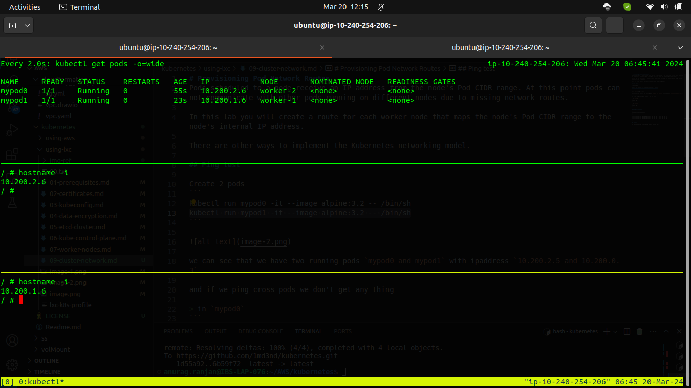
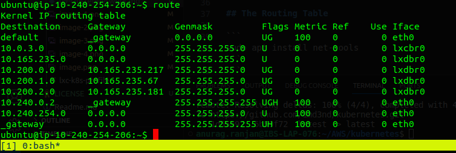
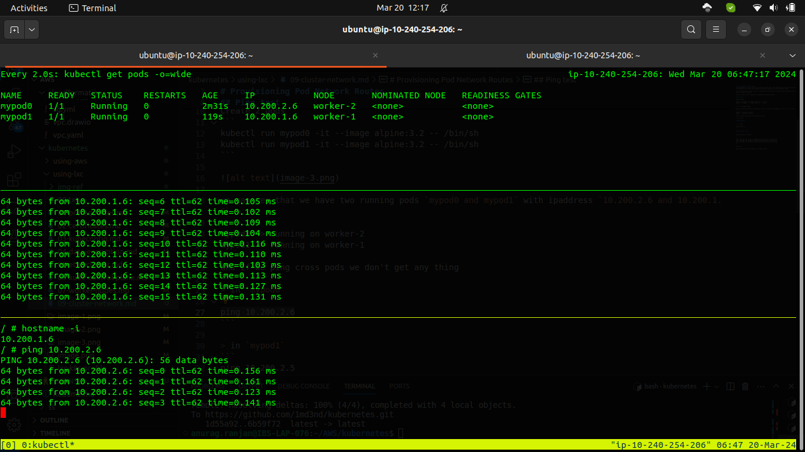

# Provisioning Pod Network Routes
Pods scheduled to a node receive an IP address from the node's Pod CIDR range. At this point pods can not communicate with other pods running on different nodes due to missing network routes.

In this lwe will create a route for each worker node that maps the node's Pod CIDR range to the node's internal IP address.


## Ping test

Create 2 pods
```
kubectl run mypod0 -it --image alpine:3.2 -- /bin/sh
kubectl run mypod1 -it --image alpine:3.2 -- /bin/sh
```



we can see that we have two running pods `mypod0 and mypod1` with ipaddress `10.200.2.6 and 10.200.1.6`.
```
mypod0 -> running on worker-2
mypod1 -> running on worker-1
```
and if we ping cross pods we don't get any thing

> in `mypod0`
```
ping 10.200.1.6
```

> in `mypod1`
```
ping 10.200.2.6
```

#### This will not work

## The Routing Table

```
sudo apt install net-tools
```
```
{
sudo route add -net 10.200.0.0 netmask 255.255.255.0 gw 10.165.235.217
sudo route add -net 10.200.1.0 netmask 255.255.255.0 gw 10.165.235.67
sudo route add -net 10.200.2.0 netmask 255.255.255.0 gw 10.165.235.181
}
```



### Verfiy 

Now we run the same ping command in each pods we get:


